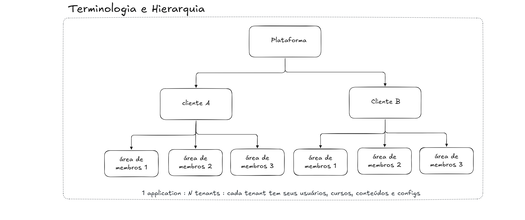
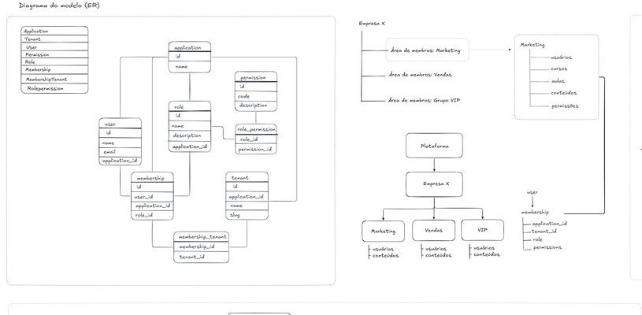
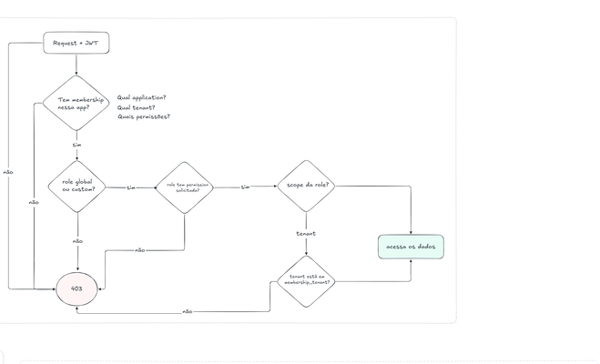
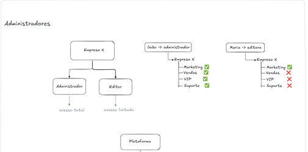
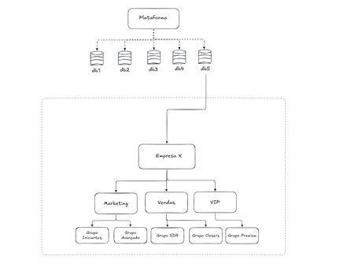
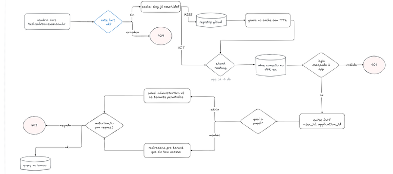
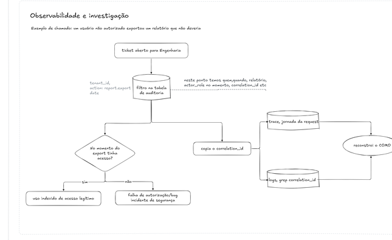
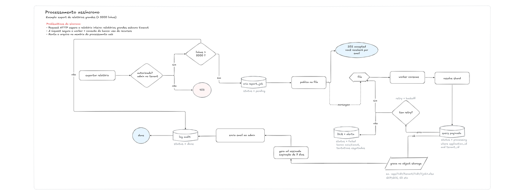

# Arch Lab: estudo de System Design

Repositório de estudos de System Design, feito de forma independente. O exercício parte de um cenário comum em produtos SaaS multi-tenant e cobre a modelagem do sistema por completo: dados, autenticação, isolamento entre clientes, processamento assíncrono e observabilidade.

O objetivo não era chegar na arquitetura "certa", e sim treinar o raciocínio e conseguir defender cada decisão. Os desenhos abaixo são o resultado. Cada bloco cobre uma parte do sistema.

## Nomenclatura

Neste exercício uso uma nomenclatura própria, que foge um pouco do padrão de mercado:

- **Application** = cliente / conta principal (no mercado costuma ser "Organization")
- **Tenant** = área de membros que pertence a uma Application ("Workspace")

Uma Application tem vários Tenants, e cada Tenant tem seus próprios usuários, cursos, conteúdos, domínios e configurações.

## 1. Terminologia e hierarquia

A base de tudo: Plataforma, clientes (Application) e áreas de membros (Tenant). Deixa explícito o `1 Application : N Tenants`.

## 2. Modelo de dados (ER)

O modelo relacional. Tem uma tabela `user` só (admins e alunos), e o vínculo com o sistema fica nas tabelas do meio:

- `membership` liga um usuário a uma Application com **uma** role;
- `membership_tenant` diz **quais** Tenants um editor pode acessar;
- `role` + `permission` + `role_permission` formam o RBAC. A role pode ser do sistema (`application_id` nulo) ou custom de um cliente.

À direita, a mesma estrutura com um exemplo concreto (Empresa X e suas áreas).

## 3. Fluxo de autorização

O que roda em cada request. Na ordem: o usuário tem membership nessa Application? A role é válida pra ela (global ou do próprio cliente)? Tem a permissão pedida? E o escopo: se a role for de Application, acessa qualquer Tenant; se for de Tenant, o Tenant precisa estar no `membership_tenant`. Qualquer check que falha vira **403**.

## 4. Administradores e roles

Admin tem acesso total; editor tem acesso limitado a Tenants específicos. O exemplo compara o João (vê todas as áreas) com a Maria (só algumas). É a leitura visual do que o modelo de dados representa.

## 5. Instâncias e sharding

Os clientes ficam distribuídos entre bancos diferentes (db1..db5), e cada Application vive dentro de um shard. Se um banco cai, só os clientes dele são afetados, o que reduz o blast radius. Dentro do shard, a hierarquia Application, Tenant e Grupo.

## 6. Fluxo do usuário final

Do acesso até o conteúdo. O domínio resolve **qual Application** (passando por rate limit e cache), descobre o shard e faz o login escopado àquela Application. Só depois do login o Tenant é decidido pelo papel: admin cai no painel, membro é redirecionado pra área dele. Toda requisição volta a checar autorização. Erros aparecem como 401 (não autenticado), 403 (sem permissão) e 429 (rate limit).

## 7. Observabilidade e investigação

Como investigar um incidente do tipo "exportaram dados indevidamente". Começa pela tabela de auditoria (quem fez, quando, o quê) e decide se a pessoa tinha acesso **no momento** do evento, já que uso indevido de acesso legítimo é diferente de falha de autorização. Depois usa o `correlation_id` pra cruzar logs e trace e reconstruir o que aconteceu.

## 8. Processamento assíncrono

Export de relatório grande (acima de 5.000 linhas). Fazer isso no request travaria tudo (timeout, memória, conexão presa), então: cria um job, publica na fila e responde na hora com **202**. Um worker consome, resolve o shard, roda a query paginada e isolada por tenant, grava o arquivo no object storage, gera uma URL assinada e manda por email. Em caso de erro, retry com backoff e, no limite, DLQ. No fim, registra no log de auditoria.

## Board completo e temas

Board completo em [`docs/images/00-board-completo.png`](docs/images/00-board-completo.png).

Temas praticados: modelagem de dados e relacionamentos, RBAC e autenticação multi-tenant, isolamento entre clientes, sharding, processamento assíncrono (fila/worker/idempotência), cache, segurança e governança (auditoria, LGPD) e observabilidade.
